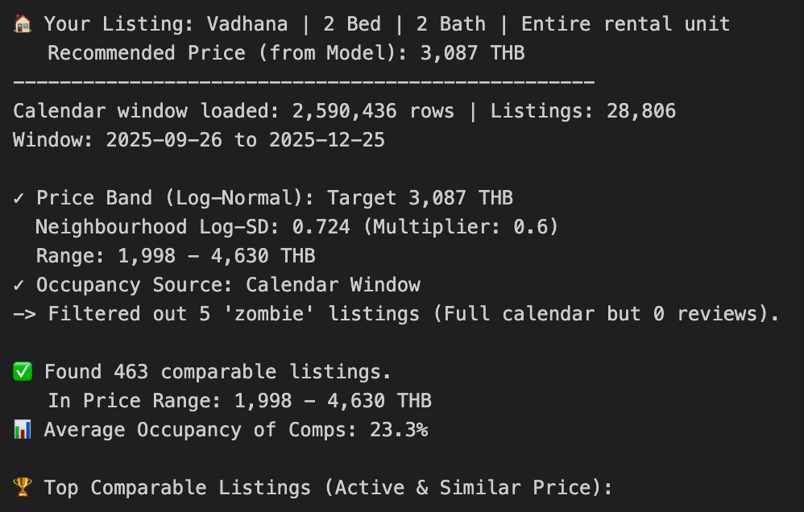

# Airbnb Price Recommender (Bangkok) — Revenue-aware Pricing for Hosts

A data science project that recommends an evidence-based nightly price for Bangkok Airbnb listings to help hosts avoid over/under-pricing and improve expected revenue.

**Problem:** Hosts often price by guesswork (copy competitors / ad-hoc rules) which can reduce bookings or cause revenue leakage.  
**Solution:** Train a model on Inside Airbnb data + context-aware feature engineering (capacity-normalized amenities, review activity, and location signals) and evaluate not only prediction error but also **Expected Total Revenue**.

---

## Business Context
Hosts need a price that balances:
- Too high → guests hesitate → lower bookings
- Too low → revenue leakage (RevPAN underperforms market potential)

This project focuses on pricing decisions aligned with real host outcomes rather than “price prediction only”.

---

## Data
Source: **Inside Airbnb** (Bangkok).  
We use 2 main tables:
- `listings.csv` (property attributes)
- `calendar.csv` (availability / pricing by date)

Train/Test split uses **two recent snapshots** (e.g., June 2025 as train, Sept 2025 as test) to simulate real-world generalization over time.

> Note: Raw data is not committed to this repo. See `data/README.md` for download instructions.

---

## Feature Engineering (Airbnb-aware)
Key idea: encode what guests pay for:
- **Capacity-normalized quality**: beds/bedrooms/bathrooms/amenities per guest (fair comparison across listing sizes)
- **Amenity richness**: amenities_count and log scaling for diminishing returns
- **Listing activeness proxy**: log(number_of_reviews) — indicates “active” supply, not necessarily high price
- **Location**: neighborhood + latitude/longitude

---

## Modeling
- Model: **Random Forest Regressor**
- Target: **log(price)** to handle heavy-tailed price distribution
- Preprocessing:
  - Numerical: median imputation
  - Categorical: one-hot encoding
- Validation:
  - Train/Test split + 5-fold CV to check stability

---

## Example Inputs for Hosts

- 'neighbourhood': 'Vadhana'
- 'property_type': 'Entire rental unit'
- 'room_type': 'Entire home/apt'
- 'accommodates': 4
- 'bedrooms': 2.0
- 'beds': 2.0
- 'bathrooms': 2.0
- 'review_scores_rating': 4.9
- 'host_is_superhost': 1
- 'latitude': 13.7309
- 'longitude': 100.5815
- 'amenities_count': 25
- 'number_of_reviews': 50

---

## Evaluation
We report:
1) **Prediction accuracy**
- RMSE
- MAPE

2) **Recommended Price**

Baselines:
- Status quo (host’s current pricing)
- Neighborhood range price (market typical range)

---

## Market Validation
To avoid unrealistic recommendations:
- Peer-based backtest against similar listings (peer median)
- Market resistance check using a log-normal price band
- Remove “zombie” listings to ensure recommendations are realistically bookable

---

## Team Project — My Role
This is a 4-person team project.

**My contributions:**
- Contributed on designing the feature engineering (capacity-normalized amenities, log transforms).
- Implemented the baseline comparisons and validation checks (peer comparison / market band).
